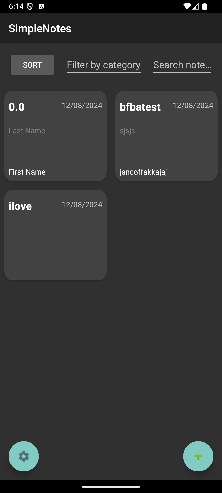
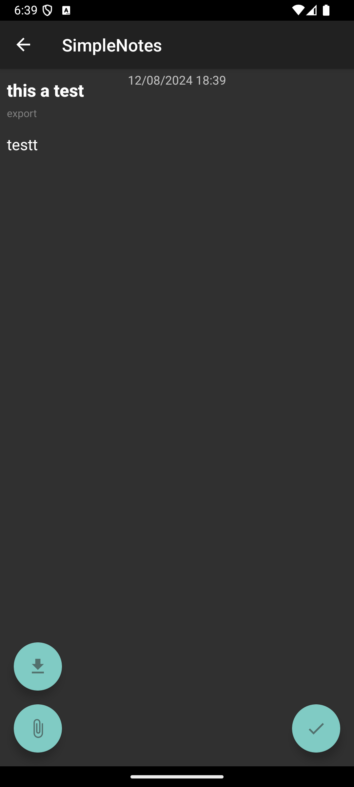

# Simple Notes Application

The Simple Notes application is a simple note-taking app that allows users to create, edit, and manage their notes easily. The app also supports importing notes from Excel files (.xls and .xlsx) and searching for notes using string matching algorithms.

## How to Use the Application

1. **Create a Note:**
   - Open the application and select the option to add a new note.
   - Fill in the title, category, and content of the note.
   - Click the "Save" button to save the note.

2. **Edit a Note:**
   - Select the note you want to edit from the list of notes.
   - Modify the required information.
   - Click the "Save" button to update the note.
3. **Delete a note:**
   - Long click the note you want to delete from the list of notes.
   - You still can undo the deletion for several seconds if you click the "undo" button.


4. **Import Notes from Excel:**
   - Click the "Add" button or select the note you want to edit.
   - Click the "Import File" button.
   - Select the Excel file containing the notes.
   - The notes will be imported and displayed in the appropriate fields.
     ```bash
     The first cell will be the "Title"
     The second cell will be the "Category"
     The third cell will be the "Content"
      ```
5. **Export Notes to Excel:**
   - Select the note you want to export from the list of notes.
   - Click the "Export File" button.
   - The notes will be exported and saved in the Documents directory with name "TitleNote_dateCreated.xls".
     ```bash
     The first cell will be the "Title"
     The second cell will be the "Category"
     The third cell will be the "Date the notes created"
     The fourth cell will be the "Date the notes recently updated"
     The fifth cell will be the "Content"
      ```
   

7. **Search for Notes:**
   - Use the search feature to find notes based on title or content.
8. **Filter for Notes:**
   - Use the filter feature to filter notes base on category.

## Sorting Algorithm Selection

This application uses two sorting algorithms: **Merge Sort** and **Quick Sort**. Here is a comparison of both:

- **Merge Sort:**
  - A divide and conquer-based sorting algorithm.
  - Has a time complexity of O(n log n) in all cases.
  - Stable (does not change the order of elements with equal values).
  - Requires additional space to store a temporary array.

- **Quick Sort:**
  - Also a divide and conquer-based sorting algorithm.
  - Has an average time complexity of O(n log n) but can degrade to O(n²) in the worst-case scenario (depending on the pivot selection).
  - Not stable.
  - Performs exceptionally well in practice due to minimal space requirements.

**Conclusion:** 
Merge Sort is more stable and has consistent performance, while Quick Sort is generally faster in practice, even though it is not stable.

## String Matching Algorithm

This application uses two string matching algorithms: **Knuth-Morris-Pratt (KMP)** and **Boyer-Moore**. Here is a comparison of both:

- **Knuth-Morris-Pratt (KMP):**
  - Utilizes information obtained from previous searches to avoid checking characters that are already known.
  - Has a time complexity of O(n + m), where n is the length of the text and m is the length of the pattern.
  - Effective for long patterns and repetitive text.

- **Boyer-Moore:**
  - Makes use of information about the pattern to shift the search further when there is a mismatch.
  - Has an average time complexity of O(n/m) but O(n * m) in the worst-case scenario.
  - Highly efficient for shorter patterns compared to longer texts.

**Conclusion:** 
KMP is more efficient for processing long texts with complex patterns, while Boyer-Moore is more efficient for searching short patterns within longer texts.

## Application Screenshots


<div style="display: flex; flex-wrap: wrap; justify-content: space-around;">
    <div style="margin: 10px;">
        
        <p>Homepage</p>
    </div>
    <div style="margin: 10px;">
        
        <p>Sorting Feature</p>
    </div>
    <div style="margin: 10px;">
        
        <p>Filtering Feature</p>
    </div>
    <div style="margin: 10px;">
        
        <p>Searching Feature</p>
    </div>
    <div style="margin: 10px;">
        
        <p>Settings Page</p>
    </div>
    <div style="margin: 10px;">
        
        <p>Deletion & Undo Feature</p>
    </div>
    <div style="margin: 10px;">
        
        <p>Add & Edit Note Page</p>
    </div>
    <div style="margin: 10px;">
        
        <p>Import File Feature</p>
    </div>
    <div style="margin: 10px;">
        
        <p>Imported File to Note</p>
    </div>
</div>


## Minimum Device Specifications

- **OS:** Android 5.0 (Lollipop) or higher
- **RAM:** Minimum 2 GB
- **Storage:** Minimum 50 MB of free space
- **Processor:** Dual-core 1.2 GHz or higher

## Study Reference
[!Watch Video](https://youtube.com/playlist?list=PLMP_OkCD54dPGjJB3sDffM6AM_UsAzcOv&si=YrOLTJTbsut_GjpQ)

